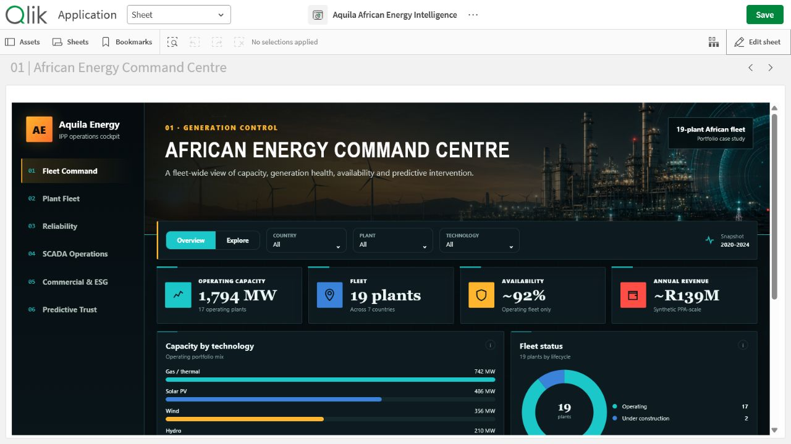

# Aquila African Energy Intelligence

An employer-facing Qlik Sense Desktop portfolio app with six complete decision pages, a custom responsive extension and original project-specific artwork.

## Six pages

1. African Energy Command Centre
2. Plant Fleet Performance
3. Availability & Reliability
4. SCADA & Anomaly Operations
5. Commercial & ESG Intelligence
6. Predictive ML & Trust

## Open locally

1. Copy `Aquila African Energy Intelligence.qvf` to `Documents/Qlik/Sense/Apps`.
2. Copy `extension/aquila-energy-intelligence` to `Documents/Qlik/Sense/Extensions/aquila-energy-intelligence`.
3. Launch Qlik Sense Desktop and open the app.

The extension is bundled because the report uses a custom full-screen visual system. Data and model caveats are kept visible inside the app.
